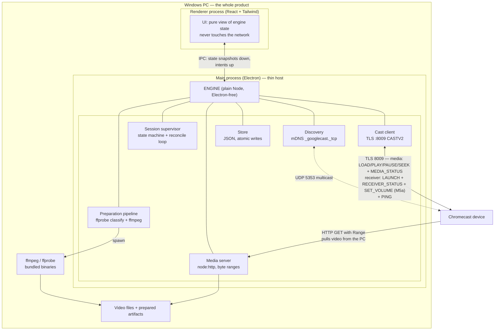

# Architecture

*If the code and this document disagree, fix one of them.*

---

## In plain language, before the detail

CastGood is **one Windows program**. You download an installer, double-click it, and CastGood appears in the Start menu like any other app. There is no terminal, no separate server to start, nothing to install first — and ffmpeg (the video tool that does the converting) is bundled inside the app rather than being something you install — which is most of why the download grew from about 96 MB to about 148 MB. Nothing about CastGood touches the internet or the cloud: it only talks to your own PC and the TVs in your house. Running costs are £0/month forever.

Inside, the app is two halves:

- **The engine** — finds the devices, serves the video file to the TV, sends play/pause/seek, and runs conversions. This is where all the reliability lives.
- **The screen** — what you look at. It is built with web technology (the same stuff websites are made of), which means the clickable mockups drawn during design become the actual app, not throwaway pictures.

Three things worth knowing:

1. **We use Google's built-in player on the TV**, not our own. Writing our own would mean a Google developer account and a website we'd have to keep online forever. The built-in one is free, always there, and never breaks. The cost is that we live within what it supports — which is fine for everything the PRD asks for.
2. **The "start watching before conversion finishes" feature was the one genuinely risky thing in the PRD, and on 19 August we watched it work.** The mechanism (chopping the converted video into small chunks and handing the TV a list that keeps growing) was tried on a Chromecast Ultra with a two-hour film: it started playing 40 seconds in, kept picking up new chunks on its own, never once asked for a piece that didn't exist yet, and when we asked it to jump to a part that hadn't been converted it quietly moved to the furthest point that *was* ready and carried on — exactly the behaviour the PRD wants. **One caveat you should know about:** the `AI PONT` set isn't a Google device and was in use that night, so it hasn't been through the same test. It will be, before this feature ships. If it behaves differently, the fallback is that "watch it now" becomes "watch it in N minutes" **on that television only** — everything else is unaffected. **One other thing to expect:** these TVs never tell us how long the film is, so the time on screen is always CastGood's own reading of the file, never the television's.
3. **The app will be unsigned** unless you buy a code-signing certificate (~$200–400/year). Unsigned means Windows shows a blue "Windows protected your PC" warning the first time you install; you click *More info → Run anyway*. For software only one household installs, that is a reasonable trade.

The rest of this document is for the build team.

---

## Stack

| Layer | Choice | Why |
|---|---|---|
| Runtime & packaging | **Electron 44**, packaged with **electron-builder** → NSIS installer | Produces a real double-clickable Windows app; Node gives us raw TCP/TLS (Cast protocol), an HTTP server, and child processes (ffmpeg) in one runtime. Zero native modules required. |
| Language | **TypeScript**, strict | One language across engine and UI. |
| UI | **React + Vite + Tailwind CSS** | The design mockups become production components. Tailwind matches the deferred-visual-design plan: placeholder styling now, restyle in M4 without touching behaviour. |
| Engine | Plain Node library under `src/engine/`, **no Electron imports** | Runs headless under `vitest` in WSL and in CI. This is what makes the reliability targets testable. |
| Cast protocol | **`castv2`** (low-level CASTV2 framing over TLS), vendored; media/receiver client hand-written on top | See ADR. The high-level wrappers are abandoned; the low-level frame codec is *finished*. |
| Discovery | **`bonjour-service`** (pure-JS mDNS, actively maintained) | Works on Windows with no Bonjour install; ~60M downloads/month. |
| Media prep | **Bundled ffmpeg + ffprobe** — pinned to **8.1.2** (gyan.dev static x64, GPL v3, upstream `38b88335f9`), invoked as child processes | Nothing to install alongside CastGood. The process boundary keeps licensing clean. Fetched and SHA-256 verified at build time from `build/ffmpeg-pin.json`, shipped as `extraResources` beside `app.asar`, found through the one seam `resolveFfmpeg()` in `src/engine/media/ffmpeg.ts`. Never in git, never across the WSL sync. See the 2026-08-20 ADR. |
| Local state | **JSON files, atomic write-and-rename**, in `%LOCALAPPDATA%\CastGood` | Data is tiny (a device memory and a prepared-file index). Avoids native SQLite, which would drag `node-gyp`/`electron-rebuild` into the WSL↔Windows build split for no benefit. |
| Receiver app on TV | **Google Default Media Receiver (`CC1AD845`)** | No developer account, no hosted HTTPS receiver, no cloud. |
| Cloud | **None.** | See *Cloud footprint*. |

**Deliberate non-choices:** no database server, no message queue, no HTTP framework (Node's `node:http` is enough for a range server), no state-management library beyond React state fed by IPC, no native addons anywhere.

---

## System diagram



The two arrows to the TV are the whole product: **we tell it what to do over TLS; it fetches the bytes from us over HTTP.** Everything else is in service of those two staying honest.

---

## What we verified about the Cast protocol (and what we didn't)

Research done 2026-08-13. Sources listed at the bottom.

**Library health.** The Node Cast ecosystem is mostly dead, as warned. `castv2-client` (the high-level client) last shipped in 2021 and its GitHub issues are unanswered — **do not depend on it**. `castv2` (the low-level protocol: TLS socket + protobuf frame codec + PING/PONG) last shipped 2022 but still does ~28k downloads/month. The reason it looks stale is that **CASTV2 is a frozen protocol**: `pychromecast` — the actively maintained Python library behind Home Assistant, 2.7k stars, commits this month — has made essentially no protocol-level changes in a year (the last 100 commits are dependency bumps, a reconnect-loop fix, and adding two Sony Bravia models to a lookup table). That is the profile of a stable protocol, not a broken one. Our position: vendor `castv2`'s ~400 lines into `src/engine/cast/castv2/` under our own tests, write the receiver/media namespace client ourselves (it's JSON messages over the frame codec), and treat **pychromecast as the reference implementation** — when behaviour is ambiguous, read its source.

**Receiver app.** A custom receiver requires a paid Google Cast developer-console registration *and* the receiver page hosted over HTTPS somewhere permanent. That is a cloud dependency and a subscription, for a personal app. Rejected. We use the **Default Media Receiver**, which is CAF-based and supports progressive MP4 and HLS. Known DMR quirk: broken relative-URL handling behind redirects — so **every URL we emit is absolute and we never redirect**.

**HTTP server requirements.** Plain `http://` works — the media URL must use an **IP address literal**, not a `.local` hostname (Home Assistant documents this explicitly; `homeassistant.local:8123/movie.mp4` fails, `192.168.1.1:8123/movie.mp4` works). Requirements we must meet:
- `Accept-Ranges: bytes` and correct `206 Partial Content` + `Content-Range` handling. Seeking in progressive MP4 *is* range requests; get this wrong and story 6 fails.
- Correct `Content-Type` (`video/mp4`, `application/x-mpegurl`, `video/mp2t`) and accurate `Content-Length`.
- `HEAD` must work.
- **CORS headers on everything — load-bearing for HLS, not insurance.** Measured on hardware 2026-08-19: without them the receiver fetches the playlist **200 OK four times in 1.7 s, requests no segment at all**, and answers `LOAD_FAILED` with **no `detailedErrorCode` and no reason**. It parses HLS in JavaScript and pulls segments by XHR into MSE, so same-origin rules apply; a progressive MP4 goes to a `<video>` element and needs none of this. **And the MP4 exemption expires the moment a subtitle track exists**: Google's documentation is explicit that enabling tracks requires CORS on *both* the track and the media stream, so a progressive MP4 that was fine bare will fail once a `.vtt` is attached to it. Set on **every** response of **every** shape, including 404s, `HEAD`, and an `OPTIONS` preflight answered `204`: **`Access-Control-Allow-Origin`: echo the request `Origin` when present, `*` when absent** (Google documents that `*` "cannot be used" where protected content is involved; we have none and SPIKE-1 saw `*` work, but the failure is diagnostic-free and the documented-safe answer costs three lines), `Allow-Methods: GET, HEAD, OPTIONS`, `Allow-Headers: Content-Type, Accept-Encoding, Range`, `Expose-Headers: Content-Length, Content-Range`.
- No HTTPS. Self-signed HTTPS is *worse* — devices reject untrusted certs, and there are documented failures of exactly that.

**Codec support is per-device and there is no capability query.** The sender API gives us no way to ask a device what it can decode. What discovery *does* give us is the mDNS TXT record: `fn=` (friendly name — this is where story 1's "real device names" comes from), `md=` (model string, e.g. `Chromecast`, `Chromecast Ultra`, `Google TV Streamer`, a Bravia model), and `ca=` (an undocumented capability bitmask that describes features like video-out and audio-in, *not* codecs — we read it but don't trust it for format decisions). Real support differs sharply: 1st/2nd gen top out at H.264 High L4.1 (1080p30) + VP8; 3rd gen L4.2 (1080p60); Ultra adds HEVC/VP9/4K/HDR; Chromecast with Google TV and Google TV Streamer add AV1; Nest Hub is 720p. Third-party "Chromecast built-in" TVs are the wild card — `md=` is a model string we've never seen.

Therefore compatibility is decided by a **three-part rule** (see *Capability policy* below), not a fixed list. **Subtitles are not part of it.** Text tracks are rendered by the receiver *application* — the same CAF-based Default Media Receiver on every device, including third-party "Chromecast built-in" boxes — not by a video decoder, so WebVTT support does not vary by generation and **the model table carries no subtitle axis**. We keep the WebVTT plain (no `::cue` styling, no positioning) so we depend only on least-common-denominator rendering. If a device ever does fail to show a track, the existing observed-failure mechanism is the *wrong* tool — it would narrow that device's video profile for a text problem — so that would need its own flag, and we will not build one before a device demands it. The `AI PONT` is the wild card here exactly as it is for head-start casting: one `LOAD` with one track on each of the three household devices is the whole check, and it belongs in the subtitles milestone.

**Head-start casting: measured on hardware 2026-08-19 (SPIKE-1), and it works.** Serving a still-growing **MP4** cannot work — the `moov` index is written last, so the file has no duration and no seek table until ffmpeg finishes, and a fragmented MP4 without an index gives neither duration nor reliable seeking. The mechanism that does work is **HLS with a growing playlist**. Each documented behaviour below is now followed by what a **Chromecast Ultra** actually did with a 6990.0 s film cut into 1592 TS segments and republished at 1.5× from a 40.0 s head start:
- The player decides live-vs-VOD **solely by the presence of `#EXT-X-ENDLIST`** — *observed*: we deliberately sent the VOD answer, `streamType: BUFFERED`, and it applied live semantics regardless.
- A growing playlist has no ENDLIST, so the player **never requests a segment that doesn't exist yet** — *observed but not proven*: 61 requests, all 200, zero 404s, across 13 playlist reads and 48 segment fetches. **Read that weakly.** Every run published at 1.5×, so the frontier led the playhead throughout and the receiver was never in a position to ask for a segment that did not exist; the spike's own "no requests past the frontier" verdict printed identically on the two runs where the television played nothing at all. The 404 was never the threat — see the live-edge stall below.
- It **reloads the playlist every `#EXT-X-TARGETDURATION` seconds** — *observed*: 13 reloads at **13.0 s ±0.1** against the `TARGETDURATION:13` we served.
- For live content it **allows seeking from the beginning of the playlist up to three target durations from the end** — ***this is the load-bearing result of the evening***, observed exactly: `liveSeekableRange.end` = published seconds at the last reload **− 39.0 s** (3 × 13 s), on all 13 reloads. A seek to 348.9 s with the frontier at 228.9 s was **silently clamped to 181.9 s** — that same `end` — and playback continued after a 1.7 s buffer.
- Pause and backward seek behave on a live-classified stream — *observed*: `PAUSE`→`PAUSED` at 123.1 s, and a backward seek to 96.3 s landed accurately and was playing again 2.1 s later.
- ffmpeg writes `#EXT-X-ENDLIST` when the conversion finishes, so the same artifact is a normal seekable VOD on every subsequent play — *observed*: on reading ENDLIST the receiver set `liveSeekableRange.isLiveDone: true` and opened the window from 285.4 s to the full 342.8 s published.
- **Duration is the one thing it will not tell us**: `media.duration: -1` in all 72 status frames, before *and* after ENDLIST. The app renders the ffprobe duration; see the 2026-08-19 ADR "CastGood owns the clock".

**What is still unknown, stated plainly:** (a) **only a Chromecast Ultra has been tested.** The main television used for development, a third-party `md=AI PONT` set, was unavailable on the night; **nothing above is a fact about it**, and SPIKE-1 must run against it before story 10 ships. (b) **The failure mode that actually threatens story 10 was never provoked: a `BUFFERING` stall at the live edge.** The playhead never reached `liveSeekableRange.end`, so we do not know whether the receiver buffers and recovers, buffers and gives up, or goes `IDLE` — and in that scenario our server answers every request 200 while the film stops anyway. M3b's spike must publish *below* playback speed (~0.6×), walk the playhead into the edge on purpose, and count `BUFFERING` seconds against a pass condition written before the run. Until then the 120 s margin is a precaution of unknown adequacy. Nothing beyond the 150 s longest watch is known either. **Fallback if the AI PONT fails SPIKE-1:** Tier 3 degrades to fully-prepared-only **for that device**, recorded in the model table — the app converts to completion, shows the estimate, and casts a normal VOD HLS artifact. Story 10 becomes "wait N minutes" there; stories 1–9 are untouched.

---

## The pipeline: discover → check → prepare → serve → control

### 1. Discover
- `bonjour-service` browses `_googlecast._tcp.local` **continuously** from app start (before the window paints — discovery starts in `app.whenReady()`, the window is a separate concern). Continuous browse, not a one-shot scan, satisfies "new device appears within 30 s" with no refresh button.
- Device identity = TXT `id=`; display name = TXT `fn=`; model = TXT `md=`; address from the A record, port from SRV (always 8009).
- Goodbye packets and TTL expiry remove devices — **except the device currently in use**, which is never removed from the list (PRD).
- Windows Firewall must permit inbound UDP 5353 and our TCP media port; the installer adds a program-scoped rule (`netsh advfirewall firewall add rule ... program="…\CastGood.exe"`). Without this you see a firewall prompt at first launch and, if you dismiss it, an app that finds nothing. This is a first-run reliability bug waiting to happen; it is the installer's job.

### 2. Check (Tier decision)
`ffprobe -v quiet -print_format json -show_format -show_streams` on the source, ≤3 s (it reads headers, not the file). Output → a pure classifier function (fully unit-testable, no I/O):

```
classify(probe, deviceProfile) -> { tier: 1|2|3|'impossible', plan, estimateSeconds, reason }
```

- **Tier 1** — container is MP4/WebM, video codec+profile+level+resolution+framerate within the device profile, audio codec **and channel count** within it too. Cast the source file untouched. *(Channels were added on 2026-08-24 after defect D1: a codec name alone described a stereo-only receiver and a 5.1-capable one identically.)*
- **Tier 2** — streams are all supported but the container isn't (MKV holding H.264+AAC is the common case). `ffmpeg -c copy` remux to MP4 with `+faststart`.
- **Tier 3** — at least one stream is unsupported. Convert **only** the offending stream (`-c:v copy -c:a aac -b:a 192k -ac 2` for the common bad-audio case, which now includes a 5.1 track in a codec the device does list), copy the rest.
- **Impossible** — no video stream, corrupt headers, or a video codec our bundled ffmpeg can't decode. Plain-language reason, decided here and never mid-cast.

Estimates come from measured throughput on this machine (remux ≈ disk write speed; transcode ≈ a rolling average of ffmpeg's own `speed=` output), seeded with a conservative default and refined from a stored per-machine history. "Based on observed speed, not a guess" is a PRD requirement.

### 3. Capability policy (the answer to "no capability query")
Three layers, most-specific wins:
1. **Conservative baseline** — H.264 High ≤L4.1, ≤1080p30, in MP4, with AAC-LC/MP3 audio in **no more than two channels**. Assumed safe for *every* Cast device including unknown third-party TVs. An unknown `md=` gets exactly this — including the `AI PONT` set, which is why the stereo cap is a decision with a price rather than a detail (2026-08-24 ADR; human checklist item 8b is how that television earns its surround sound back).
2. **Model table** — a small static map from `md=` string to a wider profile (Ultra: HEVC/VP9/4K **and six audio channels**; Google TV/Streamer: + AV1; 3rd gen: 1080p60; Nest Hub: 720p, stereo). **The channel numbers are not all the same kind of fact**: the plain Chromecast's `2` is measured on hardware, the Ultra's and Google TV's `6` are inferred from those entries already listing `ac3`/`eac3` and are unproven until checklist item 8. The 2026-08-24 ADR marks each one. Data, not code; extended as devices are met. This is precisely what pychromecast does with its `CAST_TYPES` table, and it's why that table still gets PRs.
3. **Observed truth** — if a Tier 1 cast is refused (`LOAD_FAILED` / `MEDIA_UNKNOWN` / an `IDLE` with `idleReason: ERROR` within the first seconds), we record the failing `(deviceId, codec/profile signature)` in the store, **downgrade that device's profile permanently**, and re-run the check — which now yields Tier 2 or 3. You see a preparation step start, not an error. **Only progressive-MP4 loads (Tier 1 and Tier 2) may teach this table.** SPIKE-1 showed that an HLS load rejected for a *serving* reason — missing CORS headers, an untrue `TARGETDURATION` — arrives as the very same bare `LOAD_FAILED` with no reason attached, so an HLS failure would poison the profile with a fact about our own server. HLS failures are logged as serving faults and change nothing about what we believe the device can decode. **The ladder's first rung is `cap-audio-channels`, and it never drops `aac`** (2026-08-24 ADR): a television that refuses a 5.1 film has almost certainly refused the channel count rather than the format, capping is recoverable where dropping a codec is not, and stereo `aac` is what every conversion we run produces — a profile that lost it could never call a prepared file *ready* again, so that film would be re-prepared on every selection for ever.

This makes optimism bounded and self-correcting, and **the bound is the cost of being wrong**, which is no longer one number. For picture and container the cost of an unknown device is what it always was: a file which *would* have cast untouched gets remuxed instead — seconds, lossless. **For audio it is higher, and honesty about that is the whole of the 2026-08-24 ADR**: a 5.1 film on an unrecognised television is downmixed, so you see *"Needs converting — about 6 minutes"* for a feature-length film and get a multi-gigabyte duplicate beside the original, where before D1 you saw *Ready to cast* and got a black screen. Measured; the "seconds" that appears in some source comments predates the measurement.

**One rule governs this whole section: a capability the profile does not state is a capability nothing can check.** D1 shipped with M3a and survived a 32/32 selftest run on the television it broke, because no fixture carried multichannel audio and no field existed to compare it against. Any new axis on `DeviceProfile` is therefore **required, not optional**, and lands with its single reader and a fixture that can express its violation. The dimensions still unstated today — HDR/colour transfer above all, which fails as a bad-looking picture rather than a refusal and so can never teach layer 3 — are named with recommendations at the foot of the 2026-08-24 ADR.

### 4. Prepare
- **One encoder, and it is ffmpeg** (2026-08-19 ADR; HandBrakeCLI was considered and rejected). ffmpeg runs as a child process with `-progress pipe:1 -nostats` so progress parsing is machine-readable, not scraped from stderr — and that stream carries `speed=1.5x` directly, which is the number M3b's head-start gate is specified against.
- **Encoder settings live in one versioned output-profile table** — `src/engine/prepare/output-profiles.ts`, one entry today (`h264-high41-1080p-aac-v1`), keyed to the capability profile, data not code — rather than in flags scattered through the pipeline. It targets the **conservative baseline** rather than the device in front of it, which is what makes "preparation only ever narrows" true: one sibling every television in the house can play, instead of two devices thrashing over one file. Every number and its reason are in that file and in the 2026-08-20 ADR. HandBrake's published device-preset JSON is legitimate reference material when choosing those numbers; the binary is not shipped. We optimise for *acceptance and speed*, not bytes: this is a gigabit LAN and a local disk, so a generous CRF and a fast preset beat a tuned bitrate ladder we would gain nothing from.
- **Hardware encoding is the only thing that turns hours into tens of minutes** for a full re-encode: try `h264_qsv` / `h264_nvenc` / `h264_amf` where the PC has one, fall back to `libx264 -preset veryfast`. **Measured on a real PC during M3a, never assumed** — and the honest estimate plus a cancel button remains the answer when it is still slow. **Still unmeasured as of 2026-08-20**: M3a shipped with the software entry only, and `outputProfileFor()` exists as a function rather than a constant so the hardware entry has one place to land. The `convert` selftest scenario prints the measured re-encode speed for exactly this decision.
- **Output artifacts, and the M3 split matters here.** **M3a ("any file plays")** produces exactly one shape: a **single `.mp4` (faststart)** beside the source, for Tier 2 (stream copy, seconds) and Tier 3 (full re-encode, minutes to hours) alike — **no HLS anywhere in M3a**. **M3b ("you don't wait")** adds the growing-playlist path *in front of* the same Tier 3 conversion, and still finishes by remuxing to that same single `.mp4`. So M3a's encoder settings are the ones M3b publishes progressively — one job, one encoder, one artifact, two releases. The M3b HLS working set is `-hls_time 4 -hls_list_size 0 -hls_playlist_type event -force_key_frames "expr:gte(t,n_forced*4)"` (forced keyframes only when re-encoding video; on an audio-only conversion the video's own GOPs set the segment boundaries and `-hls_time 4` is a floor).
- **ffmpeg's `index.m3u8` is an input, never the thing we serve.** It is wrong in two ways that matter: its `#EXT-X-TARGETDURATION` is what ffmpeg *asked* for, not what it produced (SPIKE-1's fixture declared `12` next to a **12.262256 s** segment — invalid HLS, and a candidate cause of a refused load), and its segment names are relative when the DMR wants absolute. The media server re-emits the playlist on every request: `TARGETDURATION = ceil(max(EXTINF))` over the segments that actually exist, absolute segment URLs, `no-store`. **Keep the target duration small** — it costs `3 × TARGETDURATION` of seek horizon and one target duration of new-content latency.
- **Subtitles are never carried into the MP4 and never silently dropped.** The remux maps video and audio **explicitly** — a subtitle codec must not be able to fail the job, which `-c copy` from MKV will do — and every **text-based** subtitle stream (subrip, ass/ssa, mov_text, webvtt) is extracted in the same step to `<stem> (CastGood).<lang>.vtt` beside the artifact. That is not extra work: WebVTT alongside the file is the *only* form in which a subtitle can reach a Chromecast, so extraction is preservation. **Image-based streams (PGS, VobSub, DVB) cannot become WebVTT without OCR** and are named in the verdict before you commit, never discarded in silence. The classifier reports subtitle streams as part of its verdict.
- Everything is written to a **`.partial`** staging name — `<stem> (CastGood).mp4.partial` beside the source, so the finishing move is an atomic same-volume rename; **each extracted `.vtt` stages the same way** and is renamed with it, because a job that wrote three files must never leave two of them. HLS segments stage in the app's working directory. Cancel = kill the process and delete every staging file. There are never orphans, which is a PRD state. **Every delete in the pipeline is gated on `isOurName`** — it claims `<stem> (CastGood).mp4`, `<stem> (CastGood).<lang>.vtt` and their `.partial` forms and refuses everything else, because this code runs inside your own films folder and that is the one place where being wrong destroys something irreplaceable. If the source directory cannot be written to (read-only, full, a network share), preparation falls back to the app's working directory and says so — it never fails the cast for it, and you are told **where it went, before the first byte**, which is the one place a path appears on screen in the whole product.
- **Prepared-file memory is the file, and there is no index.** `artifacts.json` was *allowed* by the 2026-08-19 sibling ADR as a cache and is deliberately not built (2026-08-20 ADR): one `ffprobe` of a local file answers story 9's 500 ms budget with two orders of magnitude to spare, and a cache that can disagree with the disk is a second source of truth about one file. `paths.artifactsFile` stays declared and unused. If the source directory cannot be written to (read-only, full, a network share), preparation falls back to the app's working directory and says so — it never fails the cast for it.
- **Disk pre-check** before starting: estimated output size (source size for remux; bitrate × duration for transcode) plus 15% headroom, checked against **the source's volume** for the MP4 and the app's working volume for any segments. Both checks happen before a single frame is written. Refuse up-front with the shortfall in GB rather than fail at 80%. The arithmetic is a **pure function** (`roomFor(estimatedBytes, freeBytes)`) so every rule about margins, rounding and wording is testable in WSL against numbers; the only I/O is `freeBytesOn`, which returns `null` for a volume it cannot interrogate — and a job proceeds on `null` rather than being refused for a measurement we could not take. **That polarity is deliberate and deliberately not universal**: here the unknown would block work that would probably have succeeded, whereas an audio stream whose channel count `ffprobe` will not state is treated as *too many*, because there the unknown would admit a file that probably will not play (2026-08-24 ADR). Every nullable field of the probe gets its polarity chosen on purpose, in the direction that does not end the evening.
- **One conversion at a time. No queue, no worker pool** — **one job slot**, and M5b changes who owns it rather than how many there are. Look-ahead (24g) is that slot held by the *next* queued item while the current film plays, and it is the first thing in this product with an incentive to make the sentence above false. It has three shapes, and one criterion holds all three: **look-ahead runs only alongside a film that is playing cleanly** — never stopped, idle, reconnecting or yielded, so nothing here ever converts with nothing on a television; **never while the playing film's own conversion is still open**, whoever started that film, by hand or by the queue's own auto-advance; and **one item ahead and no more**, so the slot is free or held and never a list. That is **24k**, clarified 2026-09-06 for exactly this purpose, and it is what keeps this bullet literally true through a whole evening rather than only through a single cast.
  **The one place two jobs are genuinely plausible is the auto-advanced head start**, and it is named rather than left to be discovered. Film 2 may begin on M3b's gate — ≥ 10 minutes prepared, ≥ 1.5× sustained (10h, unchanged) — with its own conversion still running (24y), and a look-ahead for film 3 started at that moment would be a second `ffmpeg`. 24k's last clause forbids it: film 3 waits for film 2's conversion to exit. **The handover between the two roles is a relabelling, not a start** — at the moment film 2 `LOAD`s, the process that was look-ahead *becomes* the playing film's own conversion, same process, same growing playlist, same frontier, and M3b's machinery takes it over unchanged (10i's margin guard, the *Still preparing* held picture, the unconverted region on the scrubber). Nothing is spawned and nothing is killed at the join, which is why the slot's **owner is a field rather than a subsystem** and why a queue costs no scheduler. Look-ahead also **yields by dying rather than throttling** — abandoned within 5 s of any hesitation on screen, partial work removed, begun again from scratch after 60 s of clean playing (24i) — but that is a scheduling rule protecting the zero-stall guarantee, not the thing that makes this bullet true; the slot is.
  **How a future reader checks the code still honours it**: at most one `ffmpeg` child exists at any instant; a job that exists while **nothing is on the television** is only ever the item you are *waiting for* — the ordinary between-films conversion of 24x, which is v1's preparation state reached by a new route — and never a look-ahead for an item further down; and every path that can start a look-ahead asks two questions before it does — *is a film playing cleanly?* and *has the playing film's own conversion exited*, **finishing remux included**, the segments having been remuxed and the artifact renamed into place? (That second reading is the load-bearing one: an encode that has stopped while its finishing remux still runs is still one job, and starting a look-ahead against it would put two `ffmpeg` processes on this machine.) If either question stops being asked, this bullet has quietly become false, and `queue --headstart` — zero look-ahead activity between film 2's `LOAD` and its `prepare.head_start_converted` — is the run that says so.

### 5. Serve
`node:http` bound to `0.0.0.0` on a persisted port (default 8010, scanning upward if taken).

- **Which IP do we advertise?** The classic failure of local casting apps is picking the wrong NIC (VPN adapter, WSL's vEthernet, a second NIC). We don't guess: we open the Cast TLS connection to the device *first*, then read `socket.localAddress` — the OS has already told us which interface reaches this device. That IP goes in the media URL. Correct by construction, including on multi-homed machines.
- URLs carry an unguessable per-session token: `http://<localAddress>:<port>/m/<token>/<name>.mp4`. The token is how we recognise our own content when reattaching after an app restart (story 12), and it stops anything else on the LAN from browsing your disk.
- Full `Range` support: single ranges, open-ended (`bytes=1234-`), suffix ranges, `416` on unsatisfiable, `HEAD`, `Accept-Ranges: bytes`, correct `Content-Length`/`Content-Range`. Multi-range is answered as a single range (the receiver never asks for multi).
- **Text tracks are served like any other file**: `Content-Type: text/vtt`, absolute URL, CORS headers, declared in `LOAD` as `media.tracks[]` with `trackContentId` pointing at it. The Default Media Receiver renders **only** text tracks, and only WebVTT/TTML/CEA-608 — never `mov_text` inside the MP4 (see the 2026-08-19 subtitles ADR).
- **A third kind of response: derived, computed per request.** Everything else the server sends is bytes off a disk — a source file or a prepared artifact. **Timing-corrected subtitles are neither**: `/m/<token>/sub/<trackKey>/<offsetMs>.vtt` is answered by shifting an in-memory cue list, parsed once per session, by the offset **named in its own URL**. That URL shape is deliberate — distinct content always has a distinct URL, so there is no cache to invalidate (`no-store` is set regardless) and no temp file to clean up. The rules for this class: computed from memory, never written to disk, never placed in your folder, deterministic given `(track, offset)`, cheap enough to recompute on every request (a two-hour film is a few thousand cues), exact `Content-Length`, no `Range`. **The shift itself is a pure function over cues** — `test/engine` proves it in WSL with no device, which is the cheapest place this feature can be proved.
- **The HLS shape is a second, stricter path.** Same server, different obligations: CORS headers on every response (above — without them the load fails with no reason at all), `Content-Type: application/vnd.apple.mpegurl` for the playlist and `video/mp2t` for segments, `Cache-Control: no-store` on the playlist (a cached playlist never grows), and a re-emitted playlist rather than ffmpeg's own. Because the failure mode is diagnostic-free, the server logs the shape of it: **playlist served ≥ 1, segments requested 0** means the television read the list and could not use it — a serving fault, logged as such, and one that never downgrades the device's capability profile (only progressive-MP4 loads teach that table).
- The source file handle is opened per request and errors are handled: if the source vanishes mid-stream, the socket ends cleanly and the session supervisor reports "the original file is no longer where it was" — never a raw ENOENT on screen.
- **Sleep / network change:** the server is bound to `0.0.0.0` so an IP change doesn't require rebinding, but the *advertised* IP may become stale. We subscribe to Electron's `powerMonitor` (`suspend`, `resume`, `lock-screen`) and to network-interface change polling (2 s). On resume or IP change: re-resolve the local address, re-run discovery, and if a session was active, run the reconnect-and-resume path (below). If the advertised IP changed, the resume re-issues `LOAD` with the new URL at the remembered position, which you experience as a two-second buffer.
- **The television's byte connection is a thing that can die on its own, and it is watched** *(defect D2, 2026-08-27)*. A progressive film is **one open-ended range request that stays open for the whole film**, so "no new request" is the healthy case and a request count says nothing. What matters is whether that delivery **ended owing bytes** — which is what an outage does to it — and whether anything replaced it. The server tracks, per mount, deliveries in flight, the last interruption and the last request; the session supervisor reads it after a recovery and, if nothing is fetching the film, re-issues the `LOAD`. **This is the same re-issue as the IP-change case above, on a wider trigger**: nothing on this PC is broken in either — the listening socket is wildcard-bound and survives an interface going and returning — and the receiver is the thing that has to be handed the film again.

### 6. Control and supervise
This is where the reliability targets are won or lost.

- **One connection per device**, with CASTV2 virtual connections and a `PING` every 5 s; two missed `PONG`s (10 s) declares the socket dead.
- **The session supervisor is an explicit state machine** — one enum, one reducer, exhaustive transitions, mirroring the PRD's state tables so QA can map states 1:1. States: `Idle → Connecting → Loading → Buffering → Playing ⇄ Paused → Seeking → Ended/Stopped`, with orthogonal `Reconnecting`, `Yielded` (another app took the device) and `NetworkDown`.
- **Truth flows one way: device → engine → UI.** The renderer holds no playback state of its own; it renders snapshots pushed over IPC.
- **Position without drift:** we take `currentTime` + `playerState` + a local monotonic timestamp from every `MEDIA_STATUS`, extrapolate locally at 4 Hz for smooth display, and reconcile against an explicit `GET_STATUS` every 1 s. If the extrapolation is more than 1 s from the device's report, we snap to the device. That gives a sub-second-accurate readout that cannot drift over two hours, because it is re-anchored 7,200 times.
- **Optimistic UI is time-boxed to 2 s** (a PRD rule): pressing Pause paints Paused immediately, but if the device hasn't confirmed within 2 s the display reverts to what the device actually says and we retry the command once.
- **Volume is a control's value, not a state — and it is the one place that 2 s rule does not reach** *(M5a, story 23)*. The **receiver namespace has been read-only since M1**: `src/engine/cast/index.ts` already parses `volume.level` and `volume.muted` off every receiver status, and `session/index.ts`'s `onReceiverStatus` keeps `appId`/`appName` and drops the rest, so a value the engine already holds reaches no snapshot and no screen. M5a is the two ends of that one pipe — a `SET_VOLUME` on the receiver namespace, and the parsed level surviving into the state snapshot — which is why its **whole diff lands in `src/engine/cast/` and `src/engine/session/`**, the two modules every existing selftest aggregate runs through, and why 23j makes re-running all four the milestone's largest task rather than a formality. **The app renders only a level a receiver status reported** (23b): an optimistic *Paused* is falsifiable within two seconds and an optimistic level of a hundred values is not, so the bullet above is **not** extended to volume and is itself unchanged for pause. On the wire it is the seek-coalescing shape reused — one command in flight, a single pending value that replaces rather than queues, one retry and only when the reported level has not moved at all (23a, 23d) — and **nothing crosses to the media namespace** (23e), so a volume change is invisible to everything in *The pipeline* above, adds no state to this machine and no name to the design system's vocabulary.
- **Seek coalescing:** dragging emits nothing. On release, we issue one `SEEK`; further releases while a seek is in flight replace a single pending target. Only the final position is ever sent — satisfying "rapid repeated seeks resolve to the final requested position only".
- **Reconnect-and-resume:** on socket death we keep `{deviceId, contentUrl, position, wasPlaying}`, retry connection with backoff (0.5 s, 1 s, 2 s, 4 s, then every 4 s) for 30 s, and on reconnect first `GET_STATUS`. If the device is still playing our content, we **reattach** (adopt its `mediaSessionId`) rather than reload — no interruption at all. If it's idle, we `LOAD` at the remembered position. Only after 30 s of failure do you see "Lost connection", and the position is still remembered.
  **The 30 s belongs to the run of failures, not to the attempt** *(defect D2)*. A rejoin that lands back in *Buffering* is another lap of the same failure: the clock is started by the first failure and cleared only when the television is actually playing or paused again, so a recovery that keeps succeeding while the film stays dead can no longer postpone "Lost connection" for ever. It is still suspended while **this PC** is the thing with no network (11d).
- **Reattach after app restart** is the same code path, which is why story 12 costs almost nothing once story 11 exists: on discovery of the last-used device, `GET_STATUS`; if `appId == CC1AD845` and the `contentId` carries our token, adopt the session.
- **Yielding:** a receiver status showing a different `appId` means someone took the TV. We stop supervising immediately, keep the position, and say so as a fact. We never re-launch to fight for it.
- **Frontier protection (Tier 3, live playlist):** the engine knows the conversion frontier from ffmpeg's progress output. It refuses seeks beyond `frontier − 120 s`, and if the playhead approaches within 120 s it issues `PAUSE` and shows **_Still preparing — back in about \<time\>_** until the margin recovers to **180 s** (hysteresis, so it cannot flap), then resumes by itself at the frame it held. The receiver's own three-target-duration rule is a second, independent guard. Two belts, one pair of braces.
  **This line said *Buffering* until 2026-08-21, and that was a defect.** Criterion 11e turns any *Buffering* longer than 10 s into a reconnection attempt, and the starved run's freezes were 10.2 s, 10.3 s and 25.5 s — so the guard would have torn down a healthy connection to fix something that was never the network's. The held picture has its own name and its own state (PRD, *M3b, reconciled*), and the margin is checked **at least once every 2 s for the whole session**, not once at the start: the worst freeze in that run arrived 200 s in.

---

## Data model

Everything lives under `%LOCALAPPDATA%\CastGood\`. Three small JSON documents, written atomically (temp file + `rename`), each with a `schemaVersion`.

```
settings.json      { schemaVersion, lastDeviceId, mediaPort, artifactRoot, machineThroughput,
                     session: { …, subtitle: { sourceId, label, language, offsetMs, token } | null },
                     subtitleOffsets: { [sourceKey]: { offsetMs, fingerprint, savedAtWall } } }
devices.json       { [deviceId]: { friendlyName, model, profile, observedFailures[], lastSeenAt } }
artifacts.json     { [key]: { key, sourcePath, sourceSize, sourceMtimeMs, tier,
                              artifactPath, durationSec, profileId,
                              status: 'complete'|'failed', createdAt, bytes } }
```

- `key = sha256(sourcePath + sourceSize + sourceMtimeMs)`. **`artifacts.json` is a cache, not the authority** (2026-08-19 ADR). It exists to skip two probes on the common path; nothing is ever served because the index says so, and losing the file costs a second, not correctness.
- **Artifacts live beside their source as `<stem> (CastGood).mp4`** — ruled on 2026-08-19 — not in an app-managed directory. Retention is therefore not a policy we own: you manage your own films. The app's working directory holds two things, and **neither is ever yours**: in-flight HLS segments, which never outlive the job that made them; and, since M3c, the **WebVTT working copies** of chosen subtitle tracks (`<dataDir>/subtitles`). The subtitle copies exist because criterion 20g forbids the alternative in as many words — *"your own subtitle file is byte-for-byte unchanged, its modified time is unchanged, and no new file appears beside it"* — so an extracted or shifted track is **ours**, and it lives where our own things live. They are disposable by construction: every one is re-derivable from the source film or the sidecar in under five seconds, so losing the folder costs a re-extraction and never correctness. This is the opposite of the prepared-artifact rule above, and deliberately: a prepared film is permanent and beside its source because re-making it costs an hour; a subtitle track is neither.
- **Reuse is decided by probing, never by remembering**: a candidate sibling is used only if `ffprobe` puts its duration within ±1 s of the source *and* the classifier returns Tier 1 for the chosen device. That second test is the profile key, derived from the artifact rather than recorded about it — which is why `profileId` here is a note for diagnostics, not something correctness depends on. Preparation only ever narrows, so overwriting a sibling for a narrower device is safe and one file serves the household.
- Sessions are **not** persisted. Reattach re-derives everything from the device's own status, which is more trustworthy than our memory of it. The one exception is the part the device cannot supply: the **URL it is fetching**, which died with the media server (SPIKE-2, 2026-08-17). Since M3c step 5 that includes the **subtitle** the television is showing — its source id, the rung, and the mount token every one of the thirteen declared track URLs names — for exactly the same reason and with the same discipline: no cues are stored, the words are re-read from the source, and the reattach **adopts** the ladder rather than re-declaring it (a reattach still issues no LOAD).
- **M5 adds no file, no field and no schema version.** A **volume** is never written down — not per device, not per film, not per evening (23g): the television owns its level and outlives the app, so restoring one on reattach would be changing a volume nobody asked us to change. A **queue** is never written down either — not the list, not the order, not a position (24r) — which is why `settings.json` and `devices.json` are asserted **byte-identical across a close with a queue built**, and why a reopened app reattaches to the film and treats it as a queue of one. The only M5 state with a lifetime longer than a single message is the **subtitle choice carried inside a queue** (24p): it lives in memory, is scoped to that queue, and dies with it — absent from this directory by decision, not by omission.
- **`subtitleOffsets` is the only *data* in this directory** — everything else is a cache of something re-derivable. A timing correction cannot be re-derived from the file (2026-08-19 ADR), so losing it costs you a re-nudge, which is why criterion 20f requires an applied correction to be **stated on screen** rather than applied silently. Keyed by **subtitle source** and never by film, device or session (`src/engine/subtitles/offsets.ts`), fingerprinted against the cue list it was set against so a file replaced by another release's cut is not silently "corrected", bounded at 500 entries, and cleared by *Reset* — never by turning subtitles off.

---

## Key flows

**Cast a Tier 1 file (the 5-second target)**
1. App start → discovery running, window painted (targets: interactive ≤2 s, first device ≤3 s).
2. Choose video → ffprobe → classifier says Tier 1 (≤3 s, off the UI thread).
3. Cast → TLS connect to `:8009` → read `socket.localAddress` → start/confirm HTTP server → `LAUNCH CC1AD845` → `LOAD {contentId: http://<ip>:<port>/m/<token>/file.mp4, contentType: video/mp4, streamType: BUFFERED, autoplay: true}`.
4. Receiver pulls bytes with `Range` requests; `MEDIA_STATUS` reports `BUFFERING` then `PLAYING`; the UI follows the device.

**Cast a Tier 3 file with head start (the risky one)**
1. Classifier says Tier 3, estimate shown, conversion starts into the app's working directory (HLS segments are a working format, never something left in your Films folder).
2. Head-start gate: `preparedSeconds ≥ 600 && observedSpeed ≥ 1.5×` (both PRD numbers, both configurable constants in one file).
3. `LOAD {contentId: …/index.m3u8, contentType: application/vnd.apple.mpegurl, streamType: BUFFERED}` — the values SPIKE-1 actually used; `BUFFERED` is safe because **ENDLIST alone decides live-vs-VOD**, and it was sent deliberately to prove that. Picture in **0.5 s**, steady in **2.1 s**, on a 40 s head start.
4. UI renders the true full duration **from ffprobe — the receiver reports `media.duration: -1` for the entire session** — with the unconverted region drawn from ffmpeg's own frontier and visually unavailable; the engine refuses seeks past `frontier − 120 s`. The receiver clamps independently at `liveSeekableRange.end` (= published − 3 × `TARGETDURATION`, ~47 s behind our frontier), so **a seek's landing position is always read back from the next `MEDIA_STATUS`, never assumed**.
5. ffmpeg finishes → `#EXT-X-ENDLIST` appears → the receiver sets `liveSeekableRange.isLiveDone: true` on its next reload → the segments are remuxed losslessly into `<stem> (CastGood).mp4.partial` beside the source and atomically renamed → `artifacts.json` cached as `complete`. Next play is that plain MP4, fully seekable, with no HLS involved at all.

**Wifi blip (10-second recovery target)**
1. `PONG` missed twice → state `Reconnecting`, position frozen and displayed, controls disabled, copy is "Reconnecting…".
2. Backoff reconnect. On success: `GET_STATUS` → device still playing our content? adopt. Idle? `LOAD` with `currentTime = rememberedPosition`.
3. Resumed within ~2 s of the network returning; the 10 s budget is dominated by mDNS/DHCP settling, not by us.

---

## WSL2 ↔ Windows: where code is edited, built, run, and verified

The rule: **WSL2 is a code and logic environment. Windows is the only place the product ever runs.** No bridging, no port proxies, no `netsh interface portproxy`. Cast discovery is multicast and the TV must open a TCP connection *back* to the PC — both fight WSL2's NAT, and the PRD's north star is reliability.

**Layout**

| Where | What | Contains |
|---|---|---|
| `~/CastGood` (WSL ext4) | Canonical working copy | git, editing, `npm ci`, lint, typecheck, unit + simulator tests. Fast filesystem, Linux `node_modules`. |
| `C:\CastGood` (`/mnt/c/CastGood` from WSL) | Runner copy | Windows `node_modules`, Electron, ffmpeg binaries, the running app, the installer build. |

Two `node_modules` trees is deliberate and non-negotiable: Electron and the ffmpeg binaries are Windows executables, while esbuild/rollup/vitest need Linux ones. Sharing one tree breaks both. Nothing else is duplicated — the runner copy is derived, disposable, and gitignored on the Windows side.

**Mechanism: WSL interop.** Windows executables are callable directly from bash (`/proc/sys/fs/binfmt_misc/WSLInterop`, on by default). Windows processes cannot use a UNC path (`\\wsl.localhost\…`) as a working directory, which is exactly why we mirror to `C:\` rather than running Windows tools against the WSL filesystem.

Three scripts own the boundary:

- **`scripts/win-sync.sh`** — `rsync -a --delete --exclude node_modules --exclude .git --exclude dist ~/CastGood/ /mnt/c/CastGood/`, then runs `npm.cmd ci` on the Windows side **only if `package-lock.json` changed** (hash cached). Sub-second on a no-op.
- **`scripts/win-run.sh`** — sync, then `cmd.exe /c "cd /d C:\CastGood && npm.cmd run dev"`. Vite's dev server and Electron both run on Windows; stdout/stderr stream back into the WSL terminal, so you see the app's logs live.
- **`scripts/win-stop.sh`** — kills anything still running from `C:\CastGood`. Needed because a non-interactively killed `win-run.sh` strands Electron on the Windows side; Ctrl-C only propagates from an interactive terminal. Scoped to that directory so it cannot kill an editor.
- **`scripts/win-logs.sh`** — follows the engine's JSONL log from WSL, deriving `%LOCALAPPDATA%` by asking `cmd.exe` rather than assuming the username.

- **`scripts/win-build.sh`** — sync, then `npm.cmd run build:win` (electron-builder NSIS), then copy the installer from `C:\CastGood\dist\installer\` back to `~/CastGood/dist/installer/`. electron-builder writes to a subdirectory, not `dist/` itself — the installer must not land in the same directory as the app bundle it packages.

**Two gotchas found by building this, not by reading docs.** First, `cd /d` inside the command is *not* sufficient: `cmd.exe` must also be *launched* from a real Windows directory, because starting it from a `\\wsl.localhost\` cwd makes it warn "UNC paths are not supported" and silently land in `C:\Windows`. Every Windows call therefore runs from `/mnt/c`. Second, `npm ci` silently skips Electron's binary download — no error, and `node_modules/electron/` simply has no `dist/`. `win-sync.sh` detects the missing `electron.exe` and repairs it; without that, the first `win-run.sh` fails confusingly.

**How a session living in WSL verifies work on Windows.** Three levels, in order of cost:

1. **Logs are the eyes.** The engine writes structured JSONL to `%LOCALAPPDATA%\CastGood\logs\engine-<date>.jsonl` — every state transition, every Cast message (redacted), every ffmpeg progress tick, with monotonic timestamps. WSL reads that path directly at `/mnt/c/Users/<user>/AppData/Local/CastGood/logs/`. A WSL session can `tail` the log of a Windows-side run and assert on it. This single decision removes most of the awkwardness of the split.
2. **Headless self-test.** The app supports `npm run selftest -- --device "<name>" --file <path> --scenario <name>`: it launches with no window, drives a scripted scenario against a real device, and writes a JSON verdict (`{scenario, passed, timings:{castToPictureMs, seekAccuracyMs, …}}`) to stdout and to the log dir. `scripts/win-test.sh` runs it via interop and prints the verdict in WSL. The PRD's numeric targets are assertions inside these scenarios — including `--scenario soak --loop 20` for the 20-consecutive-playthroughs target, run overnight.
3. **Human-in-the-loop QA** for what can't be automated: pulling the wifi, sleeping the PC, grabbing the TV from a phone. A short checklist in the QA docs, run once per milestone.

**Escape hatch, documented but not depended on:** WSL2's mirrored networking mode (`networkingMode=mirrored` in `.wslconfig`) does support multicast and can make mDNS work from inside WSL. Reports of it being flaky are common, and it changes nothing about shipping — the product is a Windows app either way. Use it if it helps a spike; never let a test depend on it.

---

## How the reliability targets are met

| Target | Mechanism | How it's tested |
|---|---|---|
| Window interactive ≤2 s | Renderer paints from empty state; discovery runs in main and streams results in. No blocking work before first paint. | Timestamp in the JSONL log; asserted in selftest. |
| First device ≤3 s, list complete ≤5 s | Continuous mDNS browse started in `app.whenReady()`, before window creation. | Simulator test in CI (fake responder); selftest on real LAN. |
| New device ≤30 s | Continuous browse, not one-shot; TTL-based expiry. | Real-device QA (power on a TV mid-session). |
| Verdict ≤3 s | ffprobe reads headers only; runs in a child process, never blocks. | Unit test on fixture probe JSON + timed integration test on real files. |
| Picture on TV ≤5 s (Tier 1) | No preparation, no transcode, `LOAD` straight after `LAUNCH`; local IP already known from the socket. | selftest `castToPictureMs`. |
| Play/pause ≤500 ms | Single command, no round trips before it; optimistic paint with 2 s reconciliation. | Simulator test measures command→status latency; selftest on real device. |
| Position within 1 s, no drift over 2 h | Local extrapolation re-anchored to `GET_STATUS` every 1 s. | Simulator test with a clock-skewing fake receiver; 2 h soak run. |
| Seek ≤2 s, within 1 s | Single coalesced `SEEK`; range-correct HTTP server. | Simulator + real-device selftest comparing requested vs reported position. |
| Wifi blip → resume ≤10 s | Heartbeat detection at 10 s, backoff reconnect, reattach-or-reload at remembered position — **and, since D2, a check that the television is still being sent bytes, with a re-issued `LOAD` when it is not**. | `selftest --outage network` takes the device's whole route to this PC away and back, headlessly; `--outage socket`/`heartbeat` deliberately do not, and cannot express D2. Real-device QA pulls the cable. |
| Zero preparation-caused stalls | Head-start gate + 120 s frontier margin + receiver's own three-target-duration limit (measured exact: `published − 3 × TARGETDURATION`). | **Not yet evidenced.** SPIKE-1 (Ultra, 2026-08-19) proved the seek-limit equation and saw no 404s, but published at 1.5× throughout, so the playhead never reached the live edge — the stall this row is about was never provoked. Owed: a below-playback-speed run that walks into the edge and counts `BUFFERING` seconds, the same run on the `AI PONT` television, then a full-length Tier 3 soak with stall counting from the log. |
| 20 stall-free playthroughs | Everything above. | `selftest --scenario soak --loop 20` overnight; the log is the evidence. |

---

## Testing strategy

**Unit (vitest, in WSL, in CI).** The classifier, the estimate model, the state-machine reducer, HTTP `Range` parsing, m3u8 parsing, the head-start/frontier arithmetic, URL/token handling. All pure functions — no I/O, no timers, milliseconds to run. This is where the majority of tests live because this is where the logic is.

**Integration with a fake Chromecast (in WSL, in CI).** The highest-leverage investment in the project: `test/fake-receiver/` — a TLS server on localhost that speaks CASTV2 (the real frame codec, the real namespaces) and is scriptable to misbehave: drop the socket mid-playback, report a competing `appId`, return `IDLE/ERROR` on `LOAD`, skew its clock, lag `PONG`s, refuse a seek. Paired with the real HTTP server and real ffmpeg (fixtures generated on the fly with `ffmpeg -f lavfi -i testsrc`, so no binaries in git), this exercises **every failure path in the PRD's state tables without hardware** — including reconnect-and-resume, takeover, and reattach. It runs on every PR.

**Real-device (Windows only, via interop).** The selftest scenarios above. Not in CI — no runner has a Chromecast. Run by hand on a Windows PC before each milestone sign-off, with the JSON verdict pasted into the PR.

**Manual QA checklist.** Physical interventions only: wifi off/on, PC sleep/wake, phone takeover, unplugging the TV, deleting the source file mid-play.

**CI shape** (`.github/workflows/ci.yml`, every PR):
- `ubuntu-latest`: `npm ci`, lint, typecheck, unit + fake-receiver integration tests. This is the gate.
- `windows-latest`: `npm ci`, `npm run build:win` — proves the installer still builds. Uploads the `.exe` as an artifact so any PR can be installed and tried. (Windows runner minutes bill at 2× on private repos; one job per PR is well inside the free allowance.)

---

## Release and packaging

There is no deployment. "Release" means **an installer exists**.

- `npm run build:win` → electron-builder → `CastGood-Setup-<version>.exe` (NSIS, per-user install to `%LOCALAPPDATA%\Programs\CastGood`, no admin rights needed, Start-menu and desktop shortcuts, adds the firewall rule, bundles ffmpeg/ffprobe as `extraResources`).
- `.github/workflows/release.yml`: on a `v*` tag, build on `windows-latest` and attach the installer to a GitHub Release. The install path is: open the Release page, download the `.exe`, double-click.
- **Unsigned.** Windows SmartScreen will warn on first install. Signing needs an OV/EV certificate (~$200–400/yr); recommendation is to skip it for household software and revisit only if the app is ever shared outside. Recorded as an ADR.
- **No auto-update** (explicitly out of PRD scope). New versions are a new installer.

**The AWS scaffolding this project was scaffolded with has been deleted** rather than left to rot — `infra/github-oidc.yaml`, `scripts/aws-bootstrap.sh` and `.github/workflows/deploy.yml` are gone, and `scripts/deploy.sh` is now a thin script that builds the installer and tags a release. A half-configured OIDC role and a deploy workflow that can never succeed is a trap for whoever reads this next.

## Cloud footprint

| Resource | Purpose | Est. cost/month |
|---|---|---|
| — | CastGood uses no cloud services. Nothing leaves the LAN. | **$0.00** |
| GitHub Actions | CI + building the installer | $0 (within free allowance) |

## Environments

**One: your own PC.** No staging, no prod, no environments in the deployment sense. `main` is what's released; feature branches are what's built and tested.

---

## Top risks

| # | Risk | Likelihood | Mitigation |
|---|---|---|---|
| 1 | **Head-start HLS behaves differently in practice than documented** (duration/seek on a live-classified stream). | **Lower than it was on a Chromecast Ultra; unchanged elsewhere** | **SPIKE-1 ran 2026-08-19 on the Ultra**: playlist re-read every 13.0 s, `liveSeekableRange.end = published − 3 × TARGETDURATION` exactly, pause and backward seek fine, forward seek clamped without error. **Two gaps keep this risk open**: the `AI PONT` set has not run it, and **the live-edge `BUFFERING` stall — the failure that would actually be felt — was never provoked** (everything published at 1.5×). Both close before story 10 ships, now in M3b. Fallback: fully-prepared-only Tier 3, scoped to the failing device via the model table. Blast radius is story 10 alone, and M3a is unaffected by design. |
| 2 | **`castv2` is unmaintained and a firmware change breaks it.** | Low (protocol frozen; pychromecast shows no protocol churn in a year) | Vendored into our tree with our own tests, so we can patch immediately; pychromecast is the living reference to port fixes from; the frame codec is ~400 lines we fully understand. |
| 3 | **Wrong local IP advertised** (VPN, second NIC, WSL's vEthernet) → the TV can't fetch the video. The single most common failure in this class of app. | Medium without care | Derive the IP from `socket.localAddress` of the live Cast connection. Never enumerate interfaces and guess. Log the chosen IP on every cast. |
| 4 | **Windows Firewall blocks discovery or the media server on first run.** | High if unhandled | Installer adds a program-scoped inbound rule. First-run diagnostic: if a `LOAD` succeeds but no HTTP request arrives within 3 s, say "Windows Firewall is blocking CastGood" with a one-click fix, not a generic error. |
| 5 | **Third-party "Chromecast built-in" TV with an unknown model string rejects a file we thought was Tier 1.** | Medium | Conservative baseline for unknown models + observed-failure learning that downgrades the device profile and re-plans automatically. Worst case: an unnecessary lossless remux. |
| 6 | **Tier 2 remux of a 2-hour file exceeds the 60 s target** on a slow disk, because `+faststart` rewrites the file a second time. | Medium | Measure early on a real disk with a real 2 h file. If it misses, the honest fix is to show the real estimate rather than pretend; alternatively output HLS (single pass, no rewrite) for large Tier 2 files, reusing the Tier 3 serving path. Flag it rather than silently missing the number. |
| 7 | **Prepared artifacts fill the disk** (a 2 h film is 4–10 GB). | Medium | Pre-flight space check; total-size display; PRD open question 1 must be answered before M3 ships. Never auto-delete without a stated policy. |
| 8 | **The WSL/Windows split slows the build loop or lets the two copies diverge.** | Medium | Only `win-sync.sh` writes to `C:\CastGood`; it is `--delete` so divergence is impossible. Windows side is gitignored and disposable. |
| 9 | **PC sleeps mid-film**; sockets die and the advertised IP may change. | High (it will happen) | `powerMonitor` suspend/resume hooks feed the same reconnect-and-resume path as a wifi blip; on resume the local IP is re-derived and a `LOAD` re-issued at the remembered position if it changed. |

---

## Sources

- [Supported Media for Google Cast](https://developers.google.com/cast/docs/media) — per-generation codec/container support, CORS note
- [Web Receiver Player Streaming Protocols](https://developers.google.com/cast/docs/media/streaming_protocols) — HLS: ENDLIST determines live vs VOD, playlist reload every target duration, live seek limited to three target durations from the end, segment formats
- [Cast registration requirements](https://developers.google.com/cast/docs/registration) — custom receiver needs a paid developer account and HTTPS hosting
- [Add Advanced Features to Your Web Sender](https://developers.google.com/cast/docs/web_sender/advanced) — CORS headers required (`Content-Type`, `Accept-Encoding`, `Range`), wildcard caveat; **the Default Media Receiver supports text tracks only**, and enabling a track requires CORS on the media stream as well as the track
- [Use Media Tracks](https://developers.google.com/cast/docs/android_sender/media_tracks) — `trackContentId` is the URL of a `.vtt`; track declaration in `LOAD`, `EDIT_TRACKS_INFO` to switch
- [Web Receiver Tracks](https://developers.google.com/cast/docs/web_receiver/tracks) — supported caption formats are WebVTT, TTML and CEA-608 (`mov_text`/`tx3g` is not among them)
- [`chrome.cast.media.TextTrackStyle`](https://developers.google.com/cast/docs/reference/web_sender/chrome.cast.media.TextTrackStyle) — the only track-level knob is **styling**; there is no subtitle timing/offset property anywhere in the protocol
- [`EditTracksInfoRequest`](https://developers.google.com/cast/docs/reference/web_sender/chrome.cast.media.EditTracksInfoRequest) — activates tracks **already declared at `LOAD`**; the track list cannot be changed without reloading, and the request fails on an unknown `trackId`
- [Home Assistant Google Cast integration](https://www.home-assistant.io/integrations/cast/) — media URLs must be IP literals or publicly resolvable; plain HTTP works
- [pychromecast](https://github.com/home-assistant-libs/pychromecast) — actively maintained reference implementation; `CAST_TYPES` model table; reconnect handling
- [thibauts/node-castv2](https://github.com/thibauts/node-castv2) and [node-castv2-client](https://github.com/thibauts/node-castv2-client) — protocol layer (stable, ~28k downloads/month) vs high-level client (abandoned 2021)
- [bonjour-service](https://github.com/onlxltd/bonjour-service) — maintained pure-TS mDNS
- [Chromecast mDNS TXT fields](https://github.com/jloutsenhizer/CR-Cast/wiki/Chromecast-Implementation-Documentation-WIP) — `fn`, `md`, `ca`, `id`
- [MDN: HTTP range requests](https://developer.mozilla.org/en-US/docs/Web/HTTP/Guides/Range_requests) — `Accept-Ranges`, `206`, `Content-Range`
- [WSL mirrored networking mode](https://github.com/microsoft/WSL/issues/12344) — multicast support and its caveats
